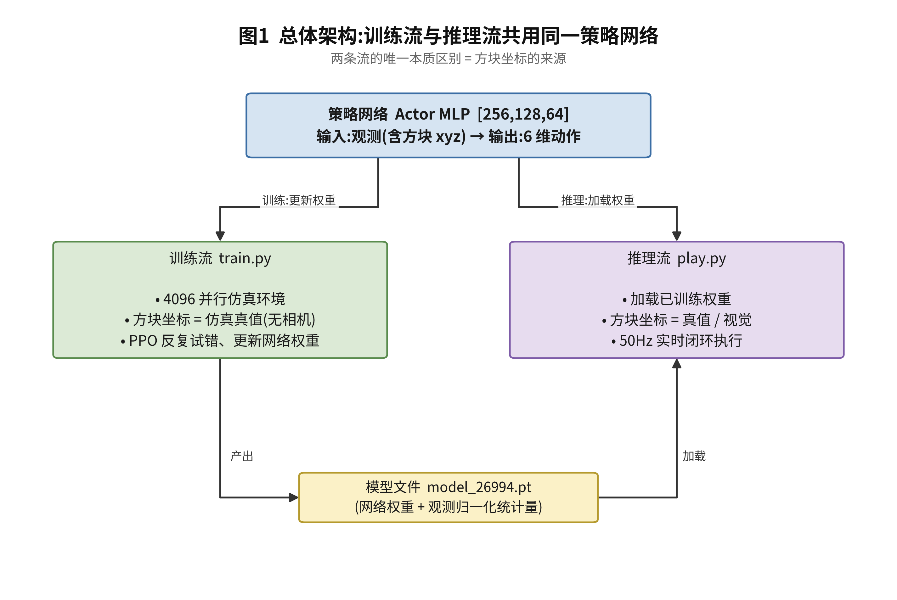
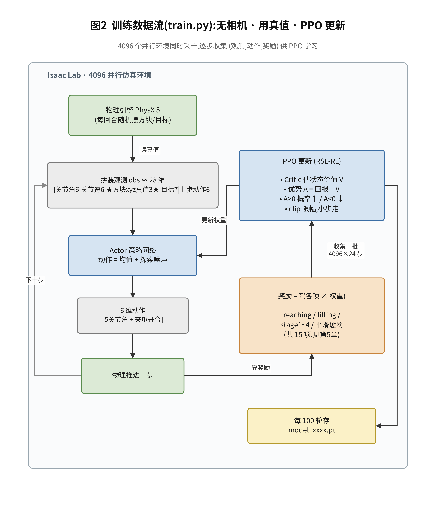
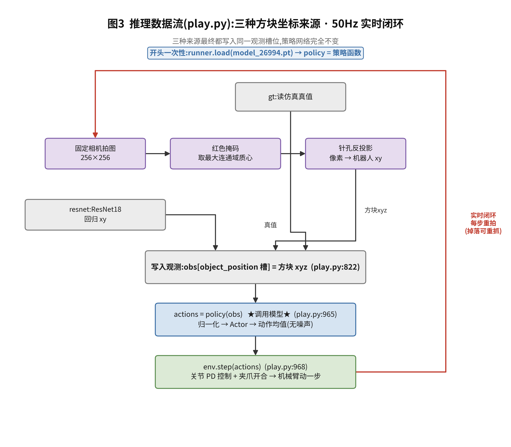
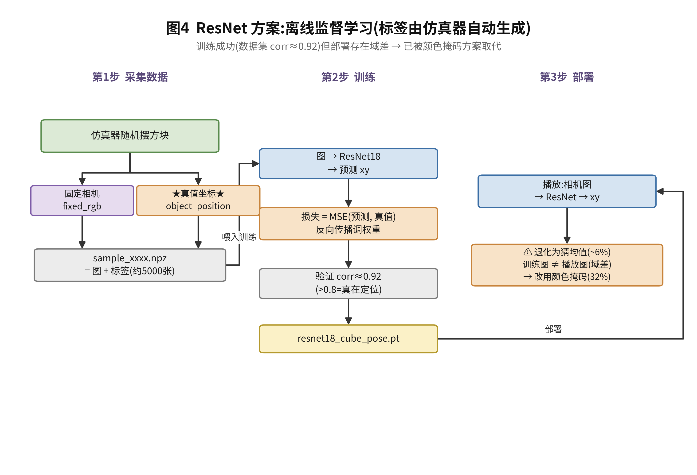
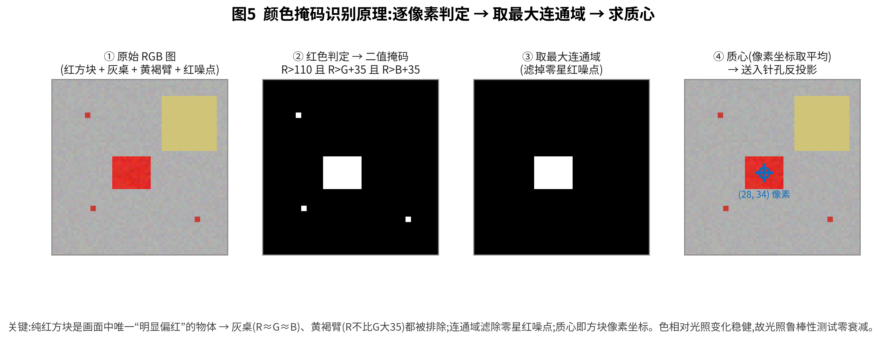
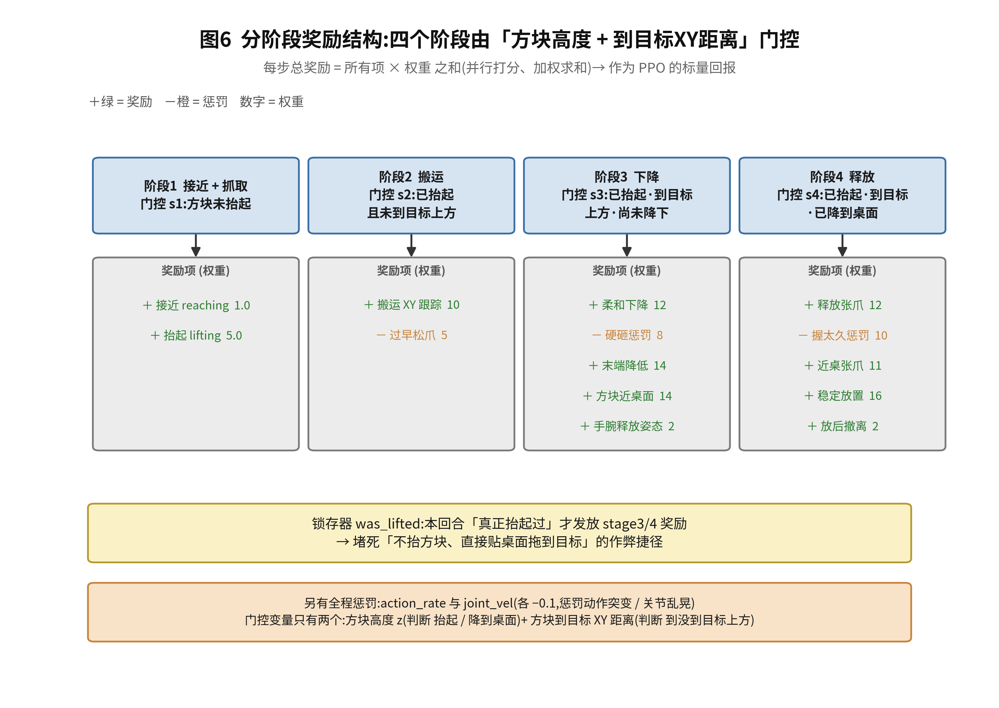
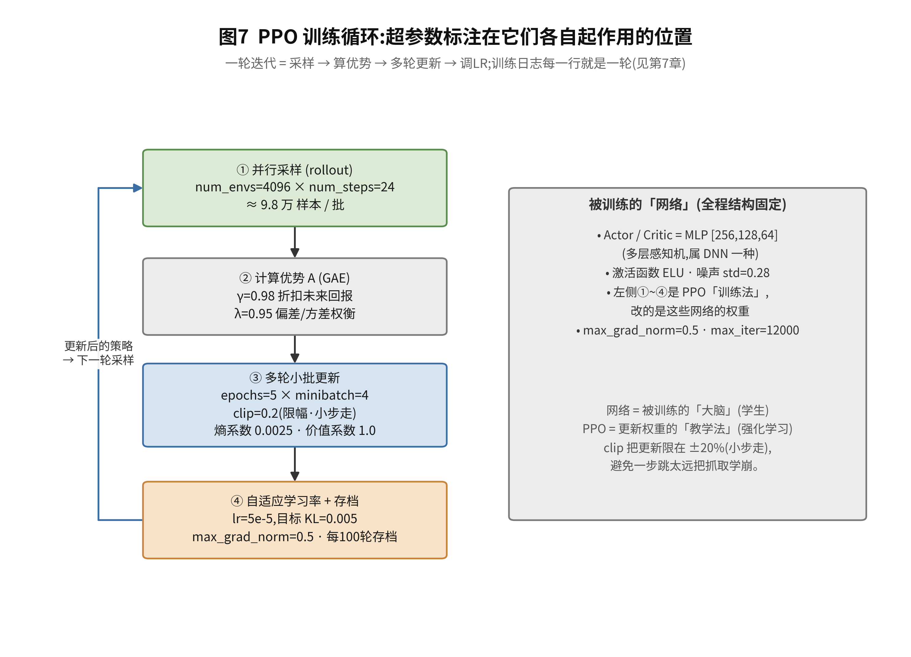
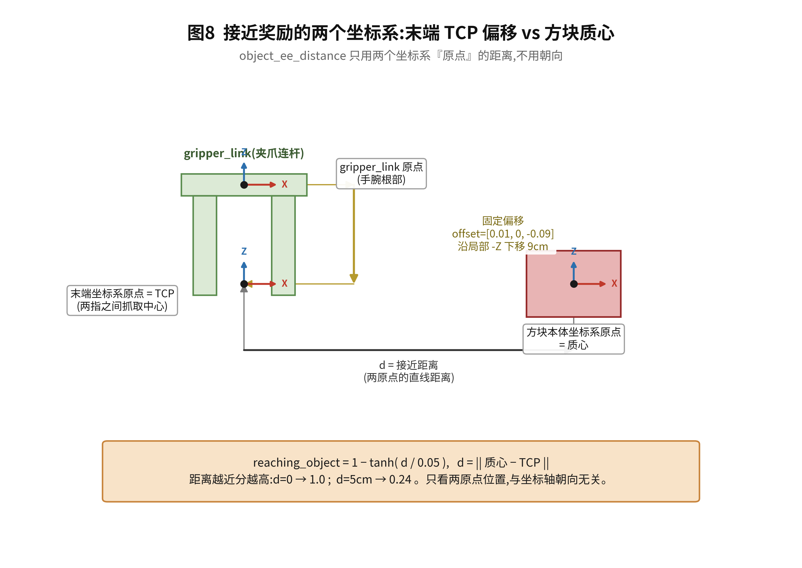

# SO-ARM101 项目 · 完整数据流框图

> 配合 `项目流程详解.md` 阅读。共 4 张图:① 总览(两条流)② 训练流 ③ 推理流(三种坐标来源)④ ResNet 离线子流程。
>
> **学术风格矢量图在 `figures/` 目录**(每张都有 `.png` 300dpi 和 `.pdf` 矢量两版,可直接插入论文/PPT);由 `make_figures.py` 生成,改了内容重跑 `CUDA_VISIBLE_DEVICES="" uv run python docs/make_figures.py` 即可。下方另附纯 ASCII 版便于在终端/纯文本里查看。

## 渲染图(figures/)

### 图1 总体架构


### 图2 训练数据流


### 图3 推理数据流


### 图4 ResNet 离线监督学习


### 图5 颜色掩码识别原理


### 图6 分阶段奖励结构


### 图7 PPO 训练循环与超参


### 图8 接近奖励的两个坐标系(末端 TCP vs 方块质心)


---

## 纯 ASCII 版(便于终端查看)

---

## 图 ①:总览——两条流共用同一个策略网络

```
                          ┌───────────────────────────┐
                          │   策略网络 (Actor MLP)      │
                          │   输入:观测(含方块 xyz)    │
                          │   输出:6 维动作            │
                          └───────────────────────────┘
                           ▲(训练时学权重)   ▲(推理时用权重)
          ┌────────────────┘                 └────────────────┐
          │                                                   │
  ╔═══════╧═══════════╗                             ╔═════════╧═══════════╗
  ║   训练流 train.py  ║                             ║   推理流 play.py     ║
  ║                   ║   方块坐标来源不同 →          ║                     ║
  ║ 方块坐标 = 仿真真值 ║   这是两条流唯一的本质区别     ║ 方块坐标 = 真值/视觉  ║
  ║ (没有相机)         ║                             ║ (有相机)             ║
  ╚═══════════════════╝                             ╚═════════════════════╝
          │                                                   │
   产出 model_26994.pt ───────────────────────────────▶ 被推理流加载
```

---

## 图 ②:训练流(train.py)—— 无相机,用真值,PPO 更新

```
 ┌──────────────────────────────────────────────────────────────────────┐
 │  4096 个并行仿真环境 (Isaac Lab)                                        │
 │                                                                        │
 │   ┌───────────┐   每回合复位:方块随机出生、目标随机采样                  │
 │   │ 物理引擎   │                                                        │
 │   └─────┬─────┘                                                        │
 │         │ 直接读真值(无渲染、无相机)                                    │
 │         ▼                                                              │
 │   拼装观测 obs ≈ 28 维                                                  │
 │   [关节角6 | 关节速6 | ★方块xyz真值3★ | 目标位姿7 | 上步动作6]            │
 │         │                                                              │
 │         ▼                                                              │
 │   ┌──────────────┐  动作=均值+探索噪声                                  │
 │   │ Actor 策略网络 │ ──────────────▶ 6维动作 [5关节角 + 夹爪开合]         │
 │   └──────────────┘                      │                             │
 │         ▲                               ▼                             │
 │         │                        物理推进一步                          │
 │         │                               │                             │
 │         │                               ▼                             │
 │         │                   ┌──────────────────────┐                  │
 │         │                   │ 奖励 = Σ(各奖励项×权重) │  ← 第5章那15项     │
 │         │                   │ reaching/lifting/     │                  │
 │         │                   │ stage1~4/penalties    │                  │
 │         │                   └──────────┬───────────┘                  │
 │         │                              │                              │
 │         └──── 收集 (obs, action, reward, value) 一批(4096×24 步) ──────┘
 │                                        │
 │                                        ▼
 │                          ┌─────────────────────────────┐
 │                          │  PPO 更新 (RSL-RL)           │
 │                          │  · Critic 估每个状态的价值 V  │
 │                          │  · 算优势 A = 实际回报 − V    │
 │                          │  · A>0 的动作概率↑ A<0 的↓    │
 │                          │  · clip 限制更新幅度(小步走)  │
 │                          │  · 反复学 5 遍               │
 │                          └──────────────┬──────────────┘
 │                                         │ 更新 Actor/Critic 权重
 │                                         ▼
 │                          每 100 轮存 checkpoint → model_xxxx.pt
 └──────────────────────────────────────────────────────────────────────┘
       训练日志(第7章)就是每一轮打印的:mean_reward / lifting_object / loss …
```

---

## 图 ③:推理流(play.py)—— 有相机,实时闭环,每 20ms 一圈

```
  开头一次性:runner.load(model_26994.pt) → policy = 可调用的策略函数
  ════════════════════════════════════════════════════════════════════

  ┌─────────────────────── 每个控制周期(50Hz)重复 ───────────────────────┐
  │                                                                      │
  │  方块坐标从哪来?由 --object_pose_source 三选一:                       │
  │                                                                      │
  │   ┌─ gt ─────────▶ 直接读仿真真值 ────────────────────┐               │
  │   │                                                  │               │
  │   ├─ vision ─┐                                        │               │
  │   │          ▼                                        │               │
  │   │   ┌─────────────┐  ┌──────────┐  ┌────────────┐  │               │
  │   │   │ 固定相机拍图  │─▶│红色掩码识别│─▶│针孔反投影    │─┤               │
  │   │   │ (256×256)   │  │取最大连通域 │  │像素→机器人xy│  │               │
  │   │   └─────────────┘  │求质心      │  └────────────┘  │ 估计的         │
  │   │                    └──────────┘  识别失败→沿用上帧  │ 方块xyz        │
  │   │                                                    │               │
  │   └─ resnet ─┐                                          │               │
  │              ▼                                          │               │
  │      ┌─────────────┐  ┌──────────────────┐             │               │
  │      │ 固定相机拍图  │─▶│ ResNet18 回归 xy   │─────────────┤               │
  │      └─────────────┘  └──────────────────┘             │               │
  │                                                        ▼               │
  │                          ┌──────────────────────────────────┐         │
  │                          │ 把坐标写进观测的 object_position 槽 │         │
  │                          │  obs[:, object_slice] = 方块xyz    │ play.py │
  │                          └────────────────┬─────────────────┘  :822   │
  │                                           ▼                            │
  │                          ┌──────────────────────────┐                 │
  │                          │ actions = policy(obs)     │ ★调用模型★       │
  │                          │ (归一化→Actor→动作均值)     │ play.py:965    │
  │                          └────────────┬─────────────┘                 │
  │                                       ▼                               │
  │                          ┌──────────────────────────┐                 │
  │                          │ env.step(actions)         │                 │
  │                          │ 关节PD控制 + 夹爪开合       │ play.py:968    │
  │                          │ 机械臂动一下,物理推进       │                 │
  │                          └────────────┬─────────────┘                 │
  │                                       │                               │
  │                                       ▼                               │
  │                          (可选) 写一行调试 CSV → funnel 评估             │
  │                                       │                               │
  └───────────────────────────────────────┘ 回到顶部,重新拍照 ───────────┘
       ★实时闭环:每步重新看 → 方块被推走/掉落,下一步即可发现并重新追★
```

---

## 图 ④:ResNet 离线子流程(监督学习,三步)

```
  第1步:采集数据 (collect_cube_pose_dataset.py)
  ─────────────────────────────────────────────
     仿真器随机摆方块  ──┬──▶ 固定相机拍图 fixed_rgb ─────────┐
                       │                                   ├──▶ sample_000123.npz
                       └──▶ 仿真真值 object_position ───────┘    = 图 + ★标签★
                            (标签免费,仿真器自带)              (共采集约 5000 张)

  第2步:训练 (train_resnet18_cube_pose.py)
  ─────────────────────────────────────────────
     for 每张(图, 真值xy):
         图 ─▶ ResNet18 ─▶ 预测xy
         loss = MSE(预测xy, 真值xy)   ← 监督信号
         反向传播,调权重
     验证:corr≈0.92 (>0.8 说明真在定位,不是猜均值)
     存 → resnet18_cube_pose.pt

  第3步:部署 (vision_pose_resnet.py,被 play.py 图③的 resnet 分支调用)
  ─────────────────────────────────────────────
     播放时:相机图 ─▶ 加载的ResNet18 ─▶ 预测xy ─▶ 写进观测
     ⚠️ 实测退化为猜均值(抓取~6%):训练图≠播放图(域差)
     → 已被图③的"颜色掩码"分支取代(抓取32%)
```

---

## 关键对照表(三种坐标来源)

| 来源 | 怎么得到方块坐标 | 是否需要训练 | 实测抓取 | 当前是否采用 |
|---|---|---|---|---|
| `gt` | 仿真器直接给真值 | — | ~35.6% | 仅用于看策略上限 |
| `vision`(颜色掩码) | 红色连通域质心 + 针孔反投影 | 不需要 | **~32%** | ★采用★ |
| `resnet` | ResNet18 看图回归 xy | 需要(监督学习) | ~6% | 已弃用(域差) |

> 注意:三种来源最终都只是把"方块 xyz"写进同一个观测槽位,**策略网络完全一样、完全不变**。换视觉方案 = 换图③里那一个框,策略不用重训。
