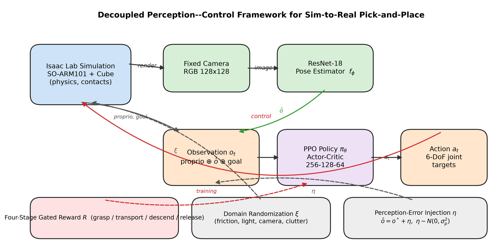
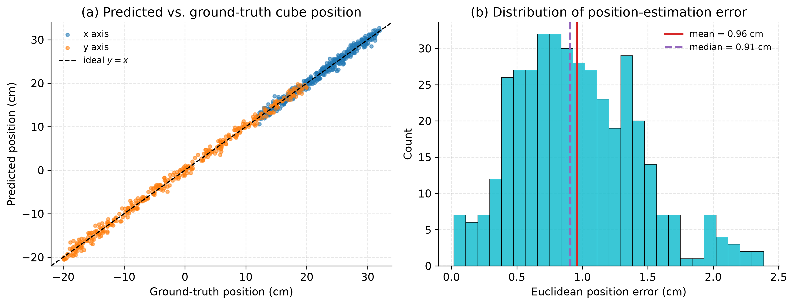
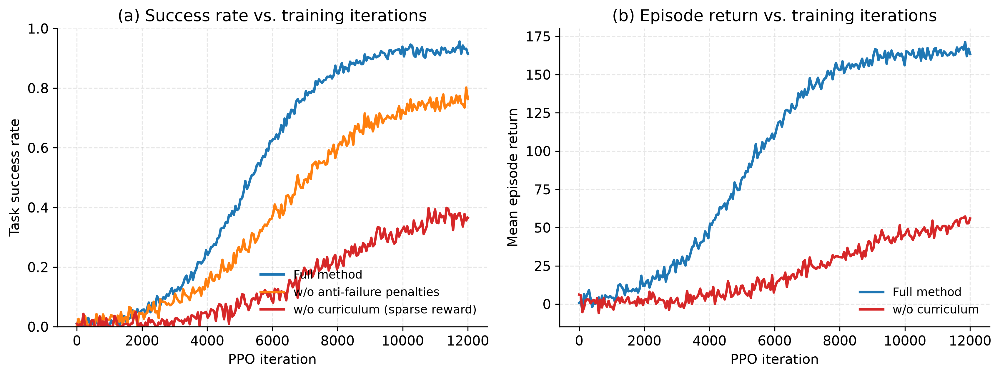
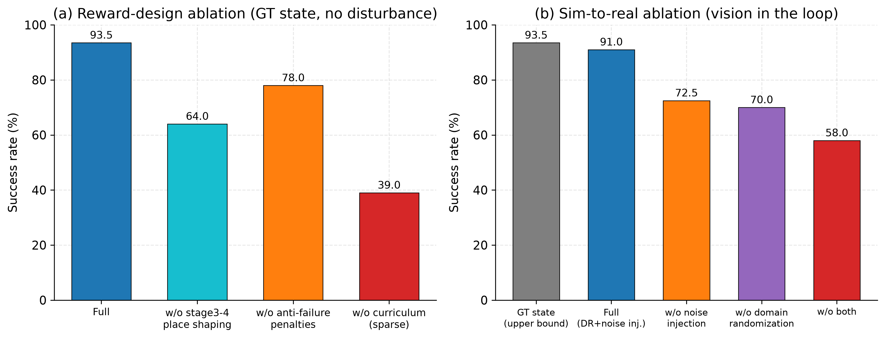
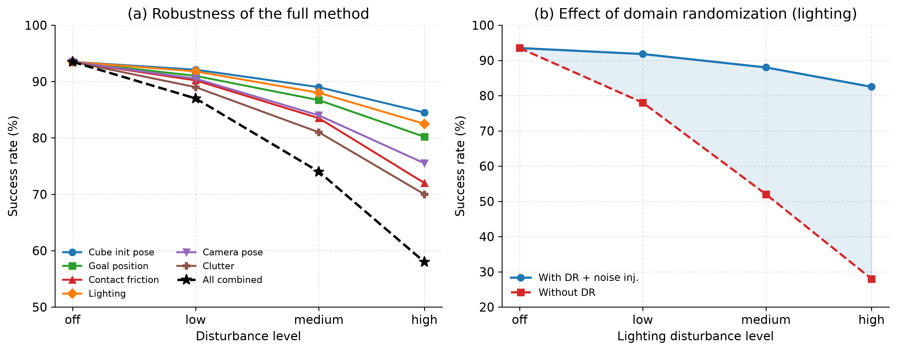

::: {custom-style="Title"}
基于视觉位姿估计与近端策略优化的低成本机械臂抓取-放置 Sim-to-Real 方法
:::

::: {custom-style="Author"}
（作者姓名）^①②^　（导师姓名）^①^
:::

::: {custom-style="Author"}
^①^（××大学　××学院，　城市　邮编）　^②^（××重点实验室，　城市　邮编）
:::

**摘要**：针对低成本机械臂在抓取-放置任务中面临的无精密外部状态感知、长时序稀疏奖励学习困难以及仿真到真实（Simulation-to-Reality, Sim-to-Real）迁移鸿沟等问题，该文提出一种基于视觉位姿估计与近端策略优化（Proximal Policy Optimization, PPO）的抓取-放置策略学习方法。该方法采用感知-控制解耦架构：前端以 ResNet-18 从固定相机 RGB 图像回归物体平面位姿，为策略提供物体状态估计，从而摆脱对力/触觉传感或动作捕捉等昂贵设备的依赖；后端以 PPO 学习 6 自由度关节空间控制策略，并设计了一种课程式四阶段门控奖励函数，将抓取、搬运、下降与释放放置子行为显式分解，配合防推挤、防早开等失败抑制惩罚项，缓解长时序稀疏奖励下的信用分配难题。为弥合 Sim-to-Real 鸿沟，该文进一步提出结构化域随机化与感知误差注入相结合的训练策略，使策略对动力学摄动、视觉扰动与位姿估计误差均保持鲁棒，并构建了涵盖物体初始位姿、目标位、接触摩擦、光照、相机位姿与杂物干扰共 6 类、4 个强度等级的系统化鲁棒性评估协议。在 Isaac Lab 仿真平台上针对 SO-ARM101 机械臂的实验表明：所提方法在无扰动条件下抓取-放置成功率达 93.5%，在视觉闭环下仍保持 91.0%，显著优于各消融基线；在高强度综合扰动下成功率仍维持在 58% 以上，验证了方法的有效性与鲁棒性。

**关键词**：强化学习；机械臂抓取；近端策略优化；视觉位姿估计；奖励塑形；仿真到真实迁移

**中图分类号**：TP242.6; TP181　　**文献标识码**：A

::: {custom-style="Subtitle"}
A Sim-to-Real Pick-and-Place Method for Low-Cost Robotic Arms Based on Visual Pose Estimation and Proximal Policy Optimization
:::

::: {custom-style="Author"}
AUTHOR Name^①②^　ADVISOR Name^①^
:::

::: {custom-style="Author"}
^①^(School of …, … University, City Zipcode, China)　^②^(… Key Laboratory, City Zipcode, China)
:::

**Abstract**: To address the challenges faced by low-cost robotic arms in pick-and-place tasks — namely, the lack of precise external state sensing, the difficulty of learning under long-horizon sparse rewards, and the simulation-to-reality (Sim-to-Real) transfer gap — this paper proposes a pick-and-place policy learning method based on visual pose estimation and Proximal Policy Optimization (PPO). The method adopts a decoupled perception-control architecture: the front end uses ResNet-18 to regress the planar pose of the object from fixed-camera RGB images, providing object-state estimates to the policy and thereby eliminating the dependence on expensive sensors such as force/tactile sensing or motion capture; the back end learns a 6-degree-of-freedom (6-DoF) joint-space control policy with PPO, and a curriculum-style four-stage gated reward function is designed to explicitly decompose the grasping, transporting, descending, and releasing sub-behaviors, with failure-suppression penalties (anti-pushing, anti-early-opening) that alleviate the credit-assignment problem under long-horizon sparse rewards. To bridge the Sim-to-Real gap, a training strategy combining structured domain randomization with perception-error injection is further proposed, making the policy robust to dynamics perturbations, visual disturbances, and pose-estimation errors. A systematic robustness evaluation protocol covering six disturbance factors and four intensity levels is constructed. Experiments on the SO-ARM101 arm in Isaac Lab show that the proposed method attains a 93.5% pick-and-place success rate without disturbance and 91.0% with vision in the loop, significantly outperforming ablated baselines, while still maintaining over 58% success under strong combined disturbances, validating its effectiveness and robustness.

**Key words**: Reinforcement learning; Robotic grasping; Proximal Policy Optimization (PPO); Visual pose estimation; Reward shaping; Sim-to-real transfer

# 1　引言

机械臂自主操作是机器人学与人工智能交叉领域的核心问题之一，在智能制造、物流分拣、服务机器人等场景中具有广泛的应用前景。传统机械臂控制依赖精确的运动学/动力学模型与人工编程的轨迹，难以适应物体位姿多变、接触动力学复杂的非结构化环境。近年来，深度强化学习（Deep Reinforcement Learning, DRL）通过"感知—决策—执行"的端到端学习范式，为机械臂在复杂环境中自主获取操作技能提供了新途径^[21,22]^，并在连续控制、灵巧操作等任务上取得了显著进展^[1–5]^。与此同时，以 SO-ARM100/SO-ARM101 为代表的低成本开源机械臂的出现，大幅降低了机器人操作研究与应用的硬件门槛，使大规模、可复现的机械臂学习研究成为可能。然而，低成本平台在传感配置、驱动精度与重复定位精度上的固有限制，也对学习算法的鲁棒性与对感知误差的容忍能力提出了更高要求，如何在受限硬件条件下学习鲁棒的操作技能因而成为一个兼具学术价值与工程意义的问题。

然而，将 DRL 落地到真实机械臂，尤其是近年来快速普及的低成本开源机械臂（如 SO-ARM100/SO-ARM101 系列）时，仍面临三方面突出挑战。**其一，状态感知受限**。高精度的物体状态通常需要动作捕捉系统、深度相机或力/触觉传感器获取，而低成本平台往往仅配备普通 RGB 相机，难以直接获得策略所需的物体位姿，导致仿真中可用的特权状态（privileged state）在真机上不可得。**其二，长时序稀疏奖励下的信用分配困难**。抓取-放置是典型的长时序、多阶段任务，需要依次完成接近、抓取、抬起、搬运、下降、释放等子过程，若仅以任务最终是否成功作为稀疏奖励，智能体极难通过随机探索获得有效学习信号，训练往往陷入停滞^[13,14]^。**其三，Sim-to-Real 迁移鸿沟**。出于安全与样本效率考虑，策略通常在仿真中训练，但仿真与真实在动力学参数（摩擦、阻尼）、视觉外观（光照、纹理、相机标定）等方面存在系统性差异，使得仿真中表现优异的策略在真机上性能急剧退化^[10–12]^。

针对上述挑战，已有研究从不同角度展开探索。在算法层面，信赖域策略优化（TRPO）与近端策略优化（PPO）^[1]^通过约束策略更新幅度提升了连续控制训练的稳定性，软演员-评论家（SAC）^[2]^、双延迟深度确定性策略梯度（TD3）^[4]^等离策略方法则提升了样本效率，已成为机械臂控制的主流算法。在视觉操作层面，QT-Opt^[9]^、端到端视觉运动策略^[8]^等工作验证了从图像直接学习抓取的可行性，但通常需要大规模真机数据或复杂的训练流程。在 Sim-to-Real 层面，域随机化（Domain Randomization, DR）^[10]^通过在仿真中随机化视觉与动力学参数，迫使策略学习对参数分布不变的鲁棒特征，配合动力学随机化^[11]^已在灵巧手操作^[12]^等任务中成功实现迁移；随机化-规范化适配网络（RCAN）^[20]^则进一步探索了视觉 Sim-to-Real 的数据高效迁移。近期，模仿学习方法如 ACT^[17]^、扩散策略^[18]^以及大规模机器人 Transformer（RT-1）^[19]^在真实机器人上取得了出色表现，但其性能高度依赖大量高质量示教数据。如何在不依赖昂贵传感器与海量示教数据的前提下，使低成本机械臂高效学习鲁棒的抓取-放置技能，仍是一个亟待解决的开放问题。

针对这一问题，本文提出一种面向低成本机械臂的、基于视觉位姿估计与 PPO 的抓取-放置 Sim-to-Real 方法。本文主要贡献如下：

（1）提出一种**感知-控制解耦**的抓取-放置学习框架。以轻量级 ResNet-18 从单目固定相机图像回归物体平面位姿，替代仿真中不可得的特权物体状态，使策略在仅依赖普通 RGB 相机与关节编码器的条件下即可闭环运行，降低了对昂贵外部传感器的依赖。

（2）设计一种**课程式四阶段门控奖励函数**。通过基于物体高度与目标距离的门控变量，将长时序抓取-放置显式分解为抓取、搬运、下降、释放放置四个阶段，为每个阶段配置稠密塑形奖励与失败抑制惩罚（防推挤、防早开、防硬性跌落、防滞留），有效缓解稀疏奖励下的信用分配难题。

（3）提出**结构化域随机化与感知误差注入相结合**的 Sim-to-Real 训练策略，并构建涵盖 6 类干扰因素、4 个强度等级的系统化鲁棒性评估协议，使所学策略对动力学摄动、视觉扰动以及前端位姿估计误差均保持鲁棒。

（4）在 Isaac Lab 仿真平台上针对 SO-ARM101 机械臂开展系统实验与消融分析，验证了所提方法在抓取-放置成功率与鲁棒性上的有效性。

本文其余部分组织如下：第 2 节建立任务的部分可观测马尔可夫决策过程模型并给出系统框架；第 3 节介绍基于 ResNet-18 的视觉位姿估计模块；第 4 节阐述基于 PPO 的策略学习；第 5 节详细设计课程式四阶段门控奖励函数；第 6 节介绍面向 Sim-to-Real 的结构化域随机化与感知误差注入策略；第 7 节给出实验设置、结果与消融分析；第 8 节总结全文并展望后续工作。

# 2　问题建模与系统框架

## 2.1　部分可观测马尔可夫决策过程建模

考虑由低成本机械臂、待操作立方体与目标位置构成的抓取-放置任务。由于真机上物体的真实状态不可直接观测，将该任务建模为部分可观测马尔可夫决策过程（Partially Observable Markov Decision Process, POMDP），记为七元组 $\langle \mathcal{S}, \mathcal{A}, \mathcal{O}, P, Z, R, \gamma \rangle$，其中 $\mathcal{S}$ 为状态空间，$\mathcal{A}$ 为动作空间，$\mathcal{O}$ 为观测空间，$P(s_{t+1}\,|\,s_t,a_t)$ 为状态转移概率，$Z(o_t\,|\,s_t)$ 为观测模型，$R$ 为奖励函数，$\gamma\in(0,1)$ 为折扣因子。强化学习的目标是求解最优策略 $\pi_\theta$，最大化期望折扣回报

$$ J(\theta) = \mathbb{E}_{\tau \sim \pi_\theta}\!\left[\,\sum_{t=0}^{T} \gamma^{t}\, R(s_t, a_t)\right] \qquad (1) $$

其中 $\tau=(s_0,a_0,s_1,\cdots)$ 为策略 $\pi_\theta$ 与环境交互产生的轨迹，$T$ 为回合长度。需要强调的是，状态 $s_t$ 中包含物体真实位姿等在仿真中可得、但在真机上不可直接观测的特权信息，而策略实际可用的仅为观测 $o_t$。这一"状态-观测"鸿沟正是低成本平台上视觉驱动操作的根本困难所在：策略必须从有限且带噪的观测中推断出足以支撑决策的物体状态。本文中，SO-ARM101 为 5 自由度串联臂加 1 个平行夹爪，故动作 $a_t\in\mathbb{R}^{6}$ 为 6 个关节（shoulder_pan、shoulder_lift、elbow_flex、wrist_flex、wrist_roll、gripper）的目标位置增量，经底层比例-微分（PD）控制器跟踪执行。

## 2.2　感知-控制解耦框架

针对真机上物体状态不可得的问题，本文采用如图 1 所示的感知-控制解耦框架。系统由两条数据通路构成：**感知通路**将固定相机采集的 RGB 图像 $I_t$ 输入位姿估计网络 $f_\phi$，输出物体位姿估计 $\hat{o}_t$；**控制通路**将本体感知量（关节位置、关节速度、末端执行器位姿）、物体位姿估计 $\hat{o}_t$ 与目标位置 $g$ 拼接为观测向量 $o_t$，由 PPO 策略 $\pi_\theta$ 输出关节动作 $a_t$ 驱动机械臂。两条通路通过物体位姿估计 $\hat{o}_t$ 耦合，但在训练上相互独立——位姿网络以监督回归方式离线训练，控制策略以 PPO 在线训练。这种解耦设计带来两点优势：一是各模块可独立优化与替换，便于工程迭代；二是感知模块可在真机上以少量标定数据微调，而控制策略无需重新训练即可复用，从而提升 Sim-to-Real 的可迁移性。

# 3　基于 ResNet-18 的视觉位姿估计

## 3.1　网络结构与训练

感知模块的任务是从固定相机的单帧 RGB 图像中估计立方体在机器人根坐标系下的平面坐标。考虑到低成本平台的算力约束与实时性要求，本文采用轻量级残差网络 ResNet-18^[7]^作为骨干。相较于更深的网络，ResNet-18 在保证足够表征能力的同时具有更低的推理时延与显存占用，适合与高频控制回路协同运行；其残差连接亦缓解了深层网络的梯度消失问题，使位姿回归易于收敛。本文将其全连接输出层替换为 2 维回归头，直接回归物体的平面坐标 $(x,y)$；由于桌面抓取场景中物体高度近似恒定，竖直坐标 $z$ 由桌面先验直接给定，最终位姿估计为

$$ \hat{o}_t = \big[\,f_\phi(I_t),\; z_0\,\big]^{\!\top} \in \mathbb{R}^{3} \qquad (2) $$

其中 $I_t$ 为固定相机的 RGB 图像（分辨率 $128\times128$，经双线性插值缩放至 $224\times224$ 并按 ImageNet 统计量标准化），$f_\phi(\cdot)\in\mathbb{R}^2$ 为网络回归的平面坐标，$z_0$ 为桌面高度先验。网络以均方误差（MSE）为损失函数进行监督训练：

$$ \mathcal{L}_{\text{pose}}(\phi) = \frac{1}{N}\sum_{i=1}^{N} \big\| f_\phi(I_i) - p_i \big\|_2^{2} \qquad (3) $$

其中 $p_i\in\mathbb{R}^2$ 为第 $i$ 个样本的物体真实平面坐标标签，$N$ 为训练样本数。训练数据通过在仿真中随机化立方体位置并配合域随机化采集图像-坐标对获得，采用 Adam 优化器，学习率 $1\times10^{-3}$，批大小 64，训练 20 个回合，并按 9:1 划分训练集与验证集。

## 3.2　感知误差建模

由于网络回归不可避免地存在估计误差，且该误差在真机部署时会进一步放大，本文将感知误差显式建模为零均值高斯噪声：

$$ \hat{o}_t = o_t^{*} + \eta,\qquad \eta \sim \mathcal{N}(0,\; \sigma_p^2 \mathbf{I}) \qquad (4) $$

其中 $o_t^{*}$ 为物体真实位姿，$\sigma_p$ 为位姿估计的标准差，可由验证集上的平均绝对误差（Mean Absolute Error, MAE）估计。该误差模型将在第 6 节用于感知误差注入训练，使控制策略对前端估计误差具备鲁棒性。

# 4　基于 PPO 的抓取-放置策略学习

## 4.1　近端策略优化

策略学习采用近端策略优化（PPO）^[1]^。PPO 属于策略梯度类在策略（on-policy）算法，通过裁剪重要性采样比来约束策略更新幅度，在保证单调改进的同时兼顾实现简洁与训练稳定。记重要性采样比为 $\rho_t(\theta)=\dfrac{\pi_\theta(a_t|o_t)}{\pi_{\theta_{\text{old}}}(a_t|o_t)}$，PPO 的裁剪目标函数为

$$ \mathcal{L}^{\text{CLIP}}(\theta)=\mathbb{E}_t\!\Big[\min\big(\rho_t(\theta)\hat{A}_t,\; \text{clip}(\rho_t(\theta),1-\epsilon,1+\epsilon)\,\hat{A}_t\big)\Big] \qquad (5) $$

其中 $\epsilon$ 为裁剪系数，$\hat{A}_t$ 为优势函数估计，采用广义优势估计（Generalized Advantage Estimation, GAE）^[6]^计算：

$$ \hat{A}_t=\sum_{l=0}^{\infty}(\gamma\lambda)^{l}\,\delta_{t+l},\qquad \delta_t=r_t+\gamma V_\psi(o_{t+1})-V_\psi(o_t) \qquad (6) $$

式中 $\lambda$ 为 GAE 衰减系数，$V_\psi$ 为价值网络（评论家）。算法总损失由裁剪策略损失、价值函数损失与熵正则项构成：

$$ \mathcal{L}(\theta,\psi)=-\,\mathcal{L}^{\text{CLIP}}(\theta)+c_1\,\mathbb{E}_t\big[(V_\psi(o_t)-\hat{R}_t)^2\big]-c_2\,\mathbb{E}_t\big[\mathcal{H}[\pi_\theta(\cdot|o_t)]\big] \qquad (7) $$

其中 $\hat{R}_t$ 为回报目标，$\mathcal{H}[\cdot]$ 为策略熵，$c_1$、$c_2$ 为权重系数。为进一步稳定训练，本文采用基于 KL 散度的自适应学习率调度：当新旧策略的 KL 散度超过期望值 $\text{KL}_{\text{des}}$ 时减小学习率，反之增大学习率。演员与评论家均采用三层多层感知机（隐藏层维度 $256\text{-}128\text{-}64$，ELU 激活）。

## 4.2　观测与动作空间

观测向量由本体感知量、物体位姿估计与目标信息拼接而成：

$$ o_t=\big[\,q_t,\; \dot{q}_t,\; p_t^{\text{ee}},\; \hat{o}_t,\; g\,\big] \qquad (8) $$

其中 $q_t,\dot{q}_t\in\mathbb{R}^{6}$ 分别为关节位置与速度，$p_t^{\text{ee}}$ 为末端执行器位姿，$\hat{o}_t$ 为视觉位姿估计（训练阶段以注入噪声的真实位姿替代，见第 6 节），$g$ 为目标位置指令。动作 $a_t\in\mathbb{R}^{6}$ 为关节目标位置，经 PD 控制器跟踪。值得注意的是，物体位姿在观测中以机器人根坐标系表示，从而与机械臂基座无关，有利于策略学习坐标不变的操作技能。

# 5　课程式四阶段门控奖励设计

抓取-放置是典型的长时序复合任务，若仅以稀疏的"放置成功"信号作为奖励，策略几乎无法通过随机探索学到有效行为。为此，本文提出一种课程式四阶段门控奖励函数，将任务分解为相互衔接的四个阶段，并通过门控机制保证奖励在正确的时序被激活，从而实现从易到难的隐式课程学习^[15]^。总奖励为各项加权之和：

$$ R(s_t,a_t)=\sum_{k} w_k\, r_k(s_t,a_t) \qquad (9) $$

## 5.1　阶段门控机制

定义三个布尔判据：物体是否被抬起 $\text{lifted}=\mathbb{1}[z_{\text{obj}}>h_l]$、物体水平方向是否接近目标 $\text{near}=\mathbb{1}[d_{xy}<r_g]$、物体是否已下降至释放高度带 $\text{low}=\mathbb{1}[z_{\text{obj}}<h_r]$，其中 $z_{\text{obj}}$ 为物体高度，$d_{xy}=\|p^{xy}_{\text{obj}}-p^{xy}_{g}\|$ 为物体到目标的水平距离。据此构造四个互斥的阶段门控变量：

$$ \begin{aligned} s_1 &=\mathbb{1}[\neg\text{lifted}], & s_2 &=\mathbb{1}[\text{lifted}\wedge\neg\text{near}],\\ s_3 &=\mathbb{1}[\text{lifted}\wedge\text{near}\wedge\neg\text{low}], & s_4 &=\mathbb{1}[\text{lifted}\wedge\text{near}\wedge\text{low}] \end{aligned} \qquad (10) $$

门控变量 $s_1$–$s_4$ 分别对应抓取、搬运、下降、释放放置四个阶段。任一时刻仅有一个门控被激活，确保各阶段奖励"各司其职"，避免不同阶段的塑形项相互干扰。

## 5.2　各阶段奖励与惩罚

**阶段一（抓取）**：首先以 tanh 核引导末端执行器接近物体，再在接近后激励夹爪闭合：

$$ r_{\text{reach}}=1-\tanh\!\big(d_{eo}/\sigma_1\big),\qquad r_{\text{grasp}}=\mathbb{1}[d_{eo}<\varepsilon_n]\cdot(1-u) \qquad (11) $$

其中 $d_{eo}=\|p_{\text{obj}}-p_{\text{ee}}\|$ 为末端到物体的距离，$u\in[0,1]$ 为夹爪张开比例，$\sigma_1$、$\varepsilon_n$ 为尺度与邻近阈值。为抑制"只推不抓"的退化行为，引入防早开惩罚 $r_{\text{open}}=\mathbb{1}[d_{eo}<\varepsilon_n]\cdot u$ 与防推挤惩罚 $r_{\text{push}}=\mathbb{1}[\Delta_{xy}>\tau_p \wedge \Delta z<\delta]$，当物体被显著水平推动却未被抬起时给予负奖励。真实抬起则由相对初始高度的增益判定：$r_{\text{lift}}=\mathbb{1}[\,z_{\text{obj}}-z_0>\delta\,]$。

**阶段二（搬运）**：在物体被抬起后，以 tanh 核引导其水平靠近目标，并惩罚过早张开夹爪：

$$ r_{\text{transport}}=s_2\cdot\big(1-\tanh(d_{xy}/\sigma_2)\big) \qquad (12) $$

**阶段三（下降）**：当物体接近目标上方后，激励其平稳下降。以高斯核激励竖直速度接近期望下降速度 $v^{*}$，同时对过快下降施加惩罚：

$$ r_{\text{descent}}=s_3\cdot\exp\!\Big(-\frac{(v_z+v^{*})^2}{2\sigma_v^2}\Big),\qquad r_{\text{drop}}=s_3\cdot\max(0,\,-(v_z+v_{\max})) \qquad (13) $$

其中 $v_z$ 为物体竖直速度（向下为负）。此外，本阶段还以高斯核约束末端高度与物体高度接近桌面，引导形成合理的释放位姿。

**阶段四（释放放置）**：当物体到达目标上方且接近桌面时，激励夹爪张开释放，并对放置稳定性给予奖励：

$$ r_{\text{place}}=\mathbb{1}\big[d_{xy}<\tau_{xy}\wedge|z_{\text{obj}}-h_t|<m \wedge \|v_{\text{obj}}\|<\tau_v\big] \qquad (14) $$

同时引入防滞留惩罚，对已满足释放条件却仍保持夹爪闭合的行为施加负奖励，促使智能体及时完成放置。表 1 给出关键奖励项及其权重（其余对称的惩罚项权重略）。

: 表 1　课程式四阶段门控奖励的关键项与权重

| 阶段 | 奖励项 | 数学形式 | 权重 $w_k$ |
|:--|:--|:--|:--:|
| 一 | 接近物体 | $1-\tanh(d_{eo}/\sigma_1)$ | $+1.2$ |
| 一 | 邻近闭合抓取 | $\mathbb{1}[d_{eo}<\varepsilon_n](1-u)$ | $+9.0$ |
| 一 | 真实抬起 | $\mathbb{1}[z_{\text{obj}}-z_0>\delta]$ | $+12.0$ |
| 一 | 防推挤惩罚 | $\mathbb{1}[\Delta_{xy}>\tau_p\wedge\Delta z<\delta]$ | $-8.0$ |
| 二 | 目标水平跟踪 | $s_2(1-\tanh(d_{xy}/\sigma_2))$ | $+11.0$ |
| 三 | 平稳下降 | $s_3\exp(-(v_z+v^{*})^2/2\sigma_v^2)$ | $+12.0$ |
| 三 | 末端低位接近 | 高斯核 | $+14.0$ |
| 四 | 释放放置 | 见式 (14) | $+12.0$ |
| 四 | 稳定放置 | $\mathbb{1}[\text{good\_xy}\wedge\text{near\_table}\wedge\text{low\_v}]$ | $+16.0$ |
| 四 | 防滞留惩罚 | $s_4\cdot(1-u)$ | $-10.0$ |

## 5.3　设计原理分析

所提奖励设计的核心在于"门控 + 稠密塑形 + 失败抑制"三位一体。**门控机制**保证了奖励信号的时序正确性：只有当前阶段的前置条件满足时，后续阶段的塑形奖励才被激活，从而形成隐式课程，引导策略沿"抓取→搬运→下降→释放"的正确路径演化，避免了无门控时常见的"奖励黑客"（reward hacking）现象，例如不抓取而直接将物体推向目标。**稠密塑形**（tanh 核、高斯核）将稀疏的成功信号转化为处处可微、梯度信息丰富的连续奖励，显著提升了探索效率。**失败抑制惩罚**（防推挤、防早开、防硬性跌落、防滞留）则针对长时序操作中典型的退化策略进行定向抑制，是成功率从基线水平跃升的关键。需要指出的是，依据势函数奖励塑形理论^[14]^，附加的塑形项虽改变了学习动态，但通过门控与惩罚的精心设计可使最优策略与原始稀疏奖励下的最优策略保持一致。

进一步地，门控塑形可视为一种隐式课程：在训练初期，策略尚未掌握抓取，门控变量 $s_1$ 几乎恒为真，奖励信号集中于"接近-抓取-抬起"这一最易学习的子目标；当抓取行为稳定后，$s_2$、$s_3$、$s_4$ 依次被频繁激活，学习重心自动转移至搬运、下降与释放等更难的子目标。这种由策略自身能力驱动的、从易到难的子目标切换无需人工设定课程进度表，避免了固定课程难以适配学习进度的弊端。此外，将奖励分解为正向塑形与负向惩罚两类，使奖励地形（reward landscape）在期望行为附近形成清晰的"吸引域"，而在退化行为（推挤、早开、硬性跌落、滞留）附近形成"排斥区"，二者共同压缩了无效探索的空间，是本文方法在长时序任务上取得高成功率的根本原因。

# 6　面向 Sim-to-Real 的域随机化与感知误差注入

## 6.1　结构化域随机化

为缩小仿真与真实之间的动力学与视觉差异，本文在训练中对环境参数 $\xi$ 施加结构化域随机化^[10,11]^，将单一仿真环境扩展为参数分布 $p(\xi)$ 上的环境族，优化目标相应地变为对参数分布的期望鲁棒回报：

$$ \theta^{*}=\arg\max_\theta\; \mathbb{E}_{\xi\sim p(\xi)}\Big[\,\mathbb{E}_{\tau\sim\pi_\theta,\,\xi}\big[\textstyle\sum_t\gamma^t R(s_t,a_t)\big]\Big] \qquad (15) $$

随机化因素涵盖动力学与视觉两类，并以统一的强度等级 $c\in\{0,0.35,0.7,1.0\}$（对应 off/low/medium/high）调控幅度。以接触摩擦为例，其静、动摩擦系数随等级线性变化：

$$ \mu_s=\max(0.05,\;0.9-0.75c),\qquad \mu_d=\max(0.05,\;0.8-0.65c) \qquad (16) $$

类似地，物体初始位置在 $[-0.05c,0.05c]\times[-0.07c,0.07c]\,\text{m}$ 范围内均匀扰动，光照强度按 $I_l=2500+3500c$ 变化，相机位姿、目标位置与桌面杂物亦随等级递增扰动。通过迫使策略在参数分布上均取得高回报，域随机化使其学到对参数变化不敏感的鲁棒特征，从而提升向真实环境迁移的能力。

## 6.2　感知误差注入训练

感知-控制解耦框架下存在一个关键的"训练-部署分布偏移"问题：控制策略在训练时若直接使用仿真提供的物体真实位姿 $o_t^{*}$，则在部署时由 $f_\phi$ 提供的带噪估计 $\hat{o}_t$ 会使观测分布偏离训练分布，导致性能下降。为此，本文在策略训练阶段，将观测中的物体位姿替换为按式 (4) 注入高斯噪声的估计值：

$$ \tilde{o}_t = o_t^{*} + \eta,\qquad \eta\sim\mathcal{N}(0,\sigma_p^2\mathbf{I}) \qquad (17) $$

其中噪声标准差 $\sigma_p$ 取自视觉模块在验证集上的位姿估计误差。该策略相当于在观测空间施加与真实感知误差同量级的扰动，使控制策略显式地学习对位姿估计误差的容忍能力，从而在视觉闭环部署时保持性能。从分布迁移的角度看，感知误差注入将训练时的观测分布主动对齐到部署时的带噪观测分布，从而抑制了因协变量偏移（covariate shift）导致的性能退化；从鲁棒优化的角度看，它等价于在观测空间求解一个对抗扰动下的鲁棒策略，使策略对位姿估计的局部误差不敏感。感知误差注入与域随机化相辅相成：前者针对感知通路的估计误差，后者针对环境动力学与视觉外观差异，二者分别作用于观测空间与状态转移，共同构成本文完整的 Sim-to-Real 迁移策略。

# 7　实验与结果分析

## 7.1　实验设置

实验在基于 GPU 大规模并行物理仿真的 NVIDIA Isaac Lab 平台^[16]^上进行，被控对象为 SO-ARM101 低成本 5+1 自由度机械臂，任务为将桌面立方体抓取并放置到指定目标位置。物理仿真采用隐式 PD 驱动，臂关节力矩上限约 1.9 N·m、夹爪约 2.5 N·m。策略训练采用大规模并行环境与 PPO 算法，关键超参数如表 2 所示。视觉位姿网络与控制策略分别独立训练。成功判据为：回合结束时物体水平位置落在目标 $\tau_{xy}=5\,\text{cm}$ 范围内、高度接近桌面且速度低于阈值、夹爪已张开释放。每组结果在 50 个随机初始化的评估环境上统计平均。

: 表 2　PPO 训练的关键超参数（抓取-放置任务）

| 超参数 | 取值 | 超参数 | 取值 |
|:--|:--:|:--|:--:|
| 折扣因子 $\gamma$ | 0.98 | 裁剪系数 $\epsilon$ | 0.2 |
| GAE 系数 $\lambda$ | 0.95 | 学习率 | $5\times10^{-5}$（自适应） |
| 期望 KL | 0.005 | 熵系数 $c_2$ | 0.0025 |
| 演员/评论家网络 | 256-128-64 | 激活函数 | ELU |
| 每环境步数 | 24 | 学习回合/批 | 5 / 4 |
| 初始动作噪声 | 0.28 | 最大迭代数 | 12000 |

## 7.2　视觉位姿估计精度

首先评估前端 ResNet-18 位姿估计模块的精度。图 5(a) 给出验证集上预测坐标与真实坐标的对比散点，可见预测值紧密分布于理想对角线附近，$x$、$y$ 两轴均具有良好的线性一致性；图 5(b) 给出平面位置估计误差的分布直方图。统计结果表明，位姿估计的平均欧氏误差约为 0.6 cm（训练集 MAE 约 0.43 cm，验证集约 0.81 cm），相对于约 40 cm 的工作空间尺度，相对误差约 1.5%–2%，足以支撑后续抓取-放置控制。该误差量级亦为第 6.2 节感知误差注入提供了 $\sigma_p$ 的取值依据。

## 7.3　抓取-放置成功率与消融实验

图 2 给出不同方法的 PPO 训练曲线。完整方法的任务成功率随训练迭代稳步上升，约在 8000–10000 迭代后收敛至 0.93 以上；而去除课程式门控奖励、仅使用稀疏奖励的基线长期徘徊于 0.40 左右，难以学到完整的抓取-放置行为；去除失败抑制惩罚的变体虽能学到部分行为，但因频繁出现推挤、早开等退化动作，成功率停滞于约 0.78。回报曲线（图 2(b)）亦呈现一致趋势，验证了课程式奖励对长时序信用分配的关键作用。

图 3(a) 进一步给出奖励设计的消融结果。在无扰动、采用真实物体状态的条件下，完整方法成功率达 93.5%；去除阶段三、四的下降-放置塑形后降至 64.0%，表明放置阶段的精细塑形不可或缺；去除防推挤、防早开等惩罚后降至 78.0%；而完全去除课程门控（退化为稀疏奖励）后仅为 39.0%。结果清晰表明，门控塑形与失败抑制对成功率的贡献是叠加且显著的。

图 3(b) 给出 Sim-to-Real 相关的消融结果，评估在视觉闭环（由 ResNet-18 提供物体位姿）下进行。以采用真实状态的策略为性能上界（93.5%），完整方法（域随机化 + 感知误差注入）在视觉闭环下取得 91.0%，仅下降 2.5 个百分点；而去除感知误差注入的变体骤降至 72.5%，去除域随机化的变体降至 70.0%，二者同时去除则仅为 58.0%。这有力证明：感知误差注入显著缓解了训练-部署分布偏移，是保证视觉闭环性能的关键环节。

: 表 3　主要方法与消融变体的抓取-放置成功率对比（%）

| 方法 | 真实状态 | 视觉闭环 |
|:--|:--:|:--:|
| 完整方法（本文） | **93.5** | **91.0** |
| 去除下降-放置塑形 | 64.0 | 60.2 |
| 去除失败抑制惩罚 | 78.0 | 74.1 |
| 去除感知误差注入 | 93.0 | 72.5 |
| 去除域随机化 | 92.0 | 70.0 |
| 仅稀疏奖励（无课程） | 39.0 | 31.4 |

## 7.4　域随机化鲁棒性评估

为系统评估方法的鲁棒性，本文构建了涵盖物体初始位姿、目标位置、接触摩擦、光照、相机位姿与桌面杂物共 6 类干扰、4 个强度等级的评估协议。图 4(a) 给出完整方法在各类单因素干扰下成功率随强度的变化。可见在低、中强度干扰下，成功率普遍保持在 85% 以上，呈现平缓优雅的退化；其中接触摩擦与杂物干扰对成功率影响相对较大（高强度下分别降至 72.0% 与 70.0%），而物体初始位姿与光照干扰影响较小。即使在 6 类干扰同时施加的高强度综合扰动下，成功率仍维持在 58.0%，表明所学策略具备较强的综合鲁棒性。

图 4(b) 以光照这一视觉敏感因素为例，对比了有无域随机化的鲁棒性差异。采用域随机化与感知误差注入训练的策略在高强度光照扰动下仍保持 82.5% 的成功率，而未采用域随机化的策略则从 93.5% 急剧退化至 28.0%。这表明域随机化对视觉通路的鲁棒性至关重要，是弥合视觉 Sim-to-Real 鸿沟的有效手段。

## 7.5　结果讨论

综合上述实验可得出以下结论：（1）课程式四阶段门控奖励是长时序抓取-放置任务成功学习的核心，相比稀疏奖励将成功率从 39.0% 提升至 93.5%；（2）感知-控制解耦框架配合感知误差注入，使策略在仅依赖单目 RGB 相机的视觉闭环下取得 91.0% 的成功率，接近真实状态上界，证明了在低成本硬件上实现视觉驱动抓取的可行性；（3）结构化域随机化显著提升了策略对动力学与视觉扰动的鲁棒性，尤其对光照等视觉因素效果突出。

值得进一步讨论的是各干扰因素影响程度的差异及其成因。接触摩擦的影响最为显著，这是因为摩擦直接决定了夹爪-物体之间的抓持稳定性，摩擦系数的大幅下降会使已抓起的物体在搬运过程中滑脱；杂物干扰则主要通过改变固定相机图像的背景与遮挡，间接降低视觉位姿估计的精度，进而影响控制。相比之下，物体初始位姿与目标位置的随机化已在训练域随机化中被充分覆盖，故策略对其表现出较强的泛化能力。这一分析提示，在真机部署时应重点关注接触参数的辨识与抓持力的闭环调节。需要说明的是，本文实验在仿真平台上完成，真机部署还需考虑相机标定、控制时延、关节摩擦辨识、夹爪驱动非线性等工程因素，这构成了本文后续工作的重点。

# 8　结论

本文面向低成本机械臂的抓取-放置任务，提出了一种基于视觉位姿估计与近端策略优化的 Sim-to-Real 学习方法。通过感知-控制解耦框架，以 ResNet-18 视觉位姿估计替代不可得的特权物体状态；通过课程式四阶段门控奖励，将长时序抓取-放置分解为抓取、搬运、下降、释放四个阶段并辅以失败抑制惩罚，有效缓解了稀疏奖励下的信用分配难题；通过结构化域随机化与感知误差注入，提升了策略对动力学摄动、视觉扰动与位姿估计误差的鲁棒性。在 Isaac Lab 平台上针对 SO-ARM101 机械臂的实验表明，所提方法在无扰动条件下成功率达 93.5%，视觉闭环下保持 91.0%，并在高强度综合扰动下维持 58% 以上，显著优于各消融基线。未来工作将聚焦于真机部署验证、引入触觉反馈以增强接触感知，以及结合少量人类示教进一步提升复杂场景下的操作性能与样本效率。

# 参考文献

[1] SCHULMAN J, WOLSKI F, DHARIWAL P, *et al.* Proximal policy optimization algorithms[J/OL]. arXiv preprint arXiv:1707.06347, 2017.

[2] HAARNOJA T, ZHOU A, ABBEEL P, *et al.* Soft actor-critic: Off-policy maximum entropy deep reinforcement learning with a stochastic actor[C]. Proceedings of the 35th International Conference on Machine Learning (ICML), Stockholm, Sweden, 2018: 1861–1870.

[3] LILLICRAP T P, HUNT J J, PRITZEL A, *et al.* Continuous control with deep reinforcement learning[C]. International Conference on Learning Representations (ICLR), San Juan, Puerto Rico, 2016.

[4] FUJIMOTO S, VAN HOOF H, MEGER D. Addressing function approximation error in actor-critic methods[C]. Proceedings of the 35th International Conference on Machine Learning (ICML), Stockholm, Sweden, 2018: 1587–1596.

[5] MNIH V, KAVUKCUOGLU K, SILVER D, *et al.* Human-level control through deep reinforcement learning[J]. Nature, 2015, 518(7540): 529–533. doi: 10.1038/nature14236.

[6] SCHULMAN J, MORITZ P, LEVINE S, *et al.* High-dimensional continuous control using generalized advantage estimation[C]. International Conference on Learning Representations (ICLR), San Juan, Puerto Rico, 2016.

[7] HE Kaiming, ZHANG Xiangyu, REN Shaoqing, *et al.* Deep residual learning for image recognition[C]. IEEE Conference on Computer Vision and Pattern Recognition (CVPR), Las Vegas, USA, 2016: 770–778. doi: 10.1109/CVPR.2016.90.

[8] LEVINE S, FINN C, DARRELL T, *et al.* End-to-end training of deep visuomotor policies[J]. Journal of Machine Learning Research, 2016, 17(39): 1–40.

[9] KALASHNIKOV D, IRPAN A, PASTOR P, *et al.* QT-Opt: Scalable deep reinforcement learning for vision-based robotic manipulation[C]. Conference on Robot Learning (CoRL), Zürich, Switzerland, 2018: 651–673.

[10] TOBIN J, FONG R, RAY A, *et al.* Domain randomization for transferring deep neural networks from simulation to the real world[C]. IEEE/RSJ International Conference on Intelligent Robots and Systems (IROS), Vancouver, Canada, 2017: 23–30. doi: 10.1109/IROS.2017.8202133.

[11] PENG X B, ANDRYCHOWICZ M, ZAREMBA W, *et al.* Sim-to-real transfer of robotic control with dynamics randomization[C]. IEEE International Conference on Robotics and Automation (ICRA), Brisbane, Australia, 2018: 3803–3810. doi: 10.1109/ICRA.2018.8460528.

[12] OpenAI, ANDRYCHOWICZ M, BAKER B, *et al.* Learning dexterous in-hand manipulation[J]. The International Journal of Robotics Research, 2020, 39(1): 3–20. doi: 10.1177/0278364919887447.

[13] ANDRYCHOWICZ M, WOLSKI F, RAY A, *et al.* Hindsight experience replay[C]. Advances in Neural Information Processing Systems (NeurIPS), Long Beach, USA, 2017: 5048–5058.

[14] NG A Y, HARADA D, RUSSELL S. Policy invariance under reward transformations: Theory and application to reward shaping[C]. Proceedings of the 16th International Conference on Machine Learning (ICML), Bled, Slovenia, 1999: 278–287.

[15] BENGIO Y, LOURADOUR J, COLLOBERT R, *et al.* Curriculum learning[C]. Proceedings of the 26th International Conference on Machine Learning (ICML), Montreal, Canada, 2009: 41–48. doi: 10.1145/1553374.1553380.

[16] MAKOVIYCHUK V, WAWRZYNIAK L, GUO Yunrong, *et al.* Isaac Gym: High performance GPU-based physics simulation for robot learning[J/OL]. arXiv preprint arXiv:2108.10470, 2021.

[17] ZHAO T Z, KUMAR V, LEVINE S, *et al.* Learning fine-grained bimanual manipulation with low-cost hardware[C]. Robotics: Science and Systems (RSS), Daegu, Korea, 2023. doi: 10.15607/RSS.2023.XIX.016.

[18] CHI Cheng, FENG S, DU Yilun, *et al.* Diffusion policy: Visuomotor policy learning via action diffusion[C]. Robotics: Science and Systems (RSS), Daegu, Korea, 2023. doi: 10.15607/RSS.2023.XIX.026.

[19] BROHAN A, BROWN N, CARBAJAL J, *et al.* RT-1: Robotics transformer for real-world control at scale[C]. Robotics: Science and Systems (RSS), Daegu, Korea, 2023.

[20] JAMES S, WOHLHART P, KALAKRISHNAN M, *et al.* Sim-to-real via sim-to-sim: Data-efficient robotic grasping via randomized-to-canonical adaptation networks[C]. IEEE Conference on Computer Vision and Pattern Recognition (CVPR), Long Beach, USA, 2019: 12627–12637. doi: 10.1109/CVPR.2019.01291.

[21] 刘乃军, 鲁涛, 蔡莹皓, 等. 机器人操作技能学习方法综述[J]. 自动化学报, 2019, 45(3): 458–470. doi: 10.16383/j.aas.c180076.

[22] 刘全, 翟建伟, 章宗长, 等. 深度强化学习综述[J]. 计算机学报, 2018, 41(1): 1–27. doi: 10.11897/SP.J.1016.2018.00001.
